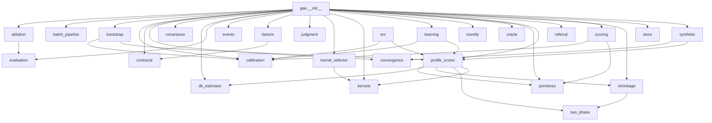

# Graph Attention Engine (GAE) Codebase Description

This document was generated from the repository source, not from aspirational docs. Behavioral claims cite source file paths and line numbers where practical. Consumer mapping is based on `CLAUDE.md`; where the repo does not prove a consumer, the entry says so.

## Phase 1 — Structural Inventory

### 1a. Directory Tree, Depth 3

Command/method: PowerShell `Get-ChildItem -Recurse -File` with filters excluding `__pycache__`, `.pyc`, `.git`, `dist`, `test-results`, and `node_modules`; displayed at approximately depth 3.

```text
.claude/settings.local.json
.code-review-graph/.gitignore
.code-review-graph/graph.db
.gitignore
.mcp.json
AGENTS.md
API_CONTRACT.md
CLAUDE.md
CODE_GRAPH_REVIEW.md
DEPENDENCIES.md
docs/gae_design_v10_6.md
docs/math_synopsis_v14.md
docs/users_guide.md
examples/minimal_domain/README.md
examples/minimal_domain/run_example.py
gae/__init__.py
gae/ablation.py
gae/batch_pipeline.py
gae/bootstrap.py
gae/calibration.py
gae/contracts.py
gae/convergence.py
gae/covariance.py
gae/dk_estimator.py
gae/enrichment_advisor.py
gae/evaluation.py
gae/events.py
gae/factors.py
gae/judgment.py
gae/kernel_selector.py
gae/kernels.py
gae/learning.py
gae/novelty.py
gae/oracle.py
gae/primitives.py
gae/profile_scorer.py
gae/referral.py
gae/scoring.py
gae/shrinkage.py
gae/snr.py
gae/store.py
gae/synthetic.py
gae/two_phase.py
graph_attention_engine.egg-info/dependency_links.txt
graph_attention_engine.egg-info/PKG-INFO
graph_attention_engine.egg-info/requires.txt
graph_attention_engine.egg-info/SOURCES.txt
graph_attention_engine.egg-info/top_level.txt
LICENSE
PROJECT_STRUCTURE.md
prompt0_gae_structural_map.py
pyproject.toml
README.md
TEST_CATEGORIES.md
test_results_gae.txt
tests/__init__.py
tests/test_ablation.py
tests/test_adversarial_inputs.py
tests/test_api_contract.py
tests/test_batch_pipeline.py
tests/test_bootstrap.py
tests/test_calibration.py
tests/test_conservation_monitor.py
tests/test_consumer_contracts.py
tests/test_consumer_roundtrip.py
tests/test_contracts.py
tests/test_convergence.py
tests/test_covariance.py
tests/test_determinism.py
tests/test_diagonal_kernel.py
tests/test_dk_estimator.py
tests/test_entropy_edge_cases.py
tests/test_evaluation.py
tests/test_events.py
tests/test_factors.py
tests/test_fw04_integration.py
tests/test_fw05_phase_a_gate.py
tests/test_fw08_checkpoint.py
tests/test_fw09_phase_b_gate.py
tests/test_generic_domains.py
tests/test_harness_validation.py
tests/test_judgment.py
tests/test_kernel_properties.py
tests/test_kernel_selector.py
tests/test_kernels.py
tests/test_learning.py
tests/test_mathematical_properties.py
tests/test_novelty.py
tests/test_numerical_stability.py
tests/test_oracle.py
tests/test_primitives.py
tests/test_profile_scorer.py
tests/test_recommend_edge_cases.py
tests/test_referral.py
tests/test_score_edge_cases.py
tests/test_scoring.py
tests/test_serialization.py
tests/test_setter_edge_cases.py
tests/test_shape_contracts.py
tests/test_shrinkage.py
tests/test_snr.py
tests/test_soc_integration.py
tests/test_store.py
tests/test_synthetic.py
tests/test_two_phase.py
tests/test_update_edge_cases.py
tools/iks_bakeoff_results.json
tools/iks_bakeoff.py
```

### 1b. File Counts

Command/method: PowerShell `Get-ChildItem -Recurse -Filter *.py` with path filters, plus `Get-Content | Measure-Object -Line`.

| Metric | Value |
|---|---:|
| Total `.py` files | 82 |
| Test `.py` files under `tests/` | 51 |
| Config/contract files counted (`pyproject.toml`, `CLAUDE.md`, `AGENTS.md`, `API_CONTRACT.md`, `.mcp.json`, `.gitignore`, `.claude/*.json`) | 9 |
| Source LOC excluding tests | 8,822 |
| Test LOC | 11,745 |

### 1c. Entry Points

`gae/__init__.py` is the package public API aggregator. It declares `__version__ = "0.7.23"` at `gae/__init__.py:51` and builds `__all__` at `gae/__init__.py:198`.

Public exports from `gae/__init__.py:198-310`: `__version__`, `CentroidUpdate`, `LearningStrategy`, `ProfileScorer`, `ScoringResult`, `KernelType`, `build_profile_scorer`, `ProfileScoringResult`, `DKEstimator`, `CoordinateDescentEstimator`, `ShrinkageSchedule`, `FixedAlpha`, `LinearRampAlpha`, `compute_effective_weights`, `OracleProvider`, `OracleResult`, `GTAlignedOracle`, `BernoulliOracle`, `EvaluationScenario`, `EvaluationReport`, `compute_ece`, `run_evaluation`, `JudgmentResult`, `compute_judgment`, `CONFIDENCE_HIGH`, `CONFIDENCE_MEDIUM`, `AblationResult`, `AblationReport`, `run_ablation`, `CalibrationProfile`, `soc_calibration_profile`, `s2p_calibration_profile`, `scaled_dot_product_attention`, `softmax`, `ALPHA`, `EPSILON`, `LAMBDA_NEG`, `W_CLAMP`, `DimensionMetadata`, `LearningState`, `PendingValidation`, `WeightUpdate`, `get_convergence_metrics`, `centroid_distance_to_canonical`, `gamma_threshold`, `phase2_effective_threshold`, `ConvergenceTrace`, `FactorVectorSample`, `FactorVectorSampler`, `CanonicalCentroid`, `OracleSeparationExperiment`, `GammaResult`, `Phase1Result`, `Phase2Result`, `ConservationMonitor`, `OLSMonitor`, `VarQMonitor`, `FactorComputedEvent`, `WeightsUpdatedEvent`, `ConvergenceEvent`, `PropertySpec`, `EmbeddingContract`, `SchemaContract`, `FactorComputer`, `assemble_factor_vector`, `save_state`, `load_state`, `BootstrapResult`, `bootstrap_calibration`, `L2Kernel`, `DiagonalKernel`, `CovarianceEstimator`, `KernelSelector`, `KernelRecommendation`, `NoveltyTracker`, `NearestNeighborNovelty`, `BatchCompositionPolicy`, `NoveltyThresholdPolicy`, `FixedIntervalPolicy`, `PromotionGate`, `DefaultPromotionGate`, `GateVerdict`, `BatchRecord`, `BatchHistory`, `ReferralEngine`, `ReferralRule`, `ReferralDecision`, `ReferralReason`, `OverrideDetector`, `score_entity`, `score_alert`, `score_with_profile`.

No root `conftest.py` was present in the inventory. `pyproject.toml` defines package `graph-attention-engine`, version `0.7.23`, Python `>=3.10`, runtime dependency `numpy>=1.24`, dev extras `pytest>=7.4` and `pytest-asyncio>=0.23`, build backend `setuptools.build_meta`, setuptools package discovery for `gae*`, and pytest `testpaths = ["tests"]` at `pyproject.toml:1-27`.

## Phase 2 — Module Map

### gae/__init__.py
**Purpose:** Package-level public API surface and version declaration.  
**Key classes/functions:** `__version__` (line 51); `__all__` (line 198) exports the public package names.  
**Imports from:** `gae.ablation`, `gae.batch_pipeline`, `gae.bootstrap`, `gae.calibration`, `gae.contracts`, `gae.convergence`, `gae.covariance`, `gae.dk_estimator`, `gae.evaluation`, `gae.events`, `gae.factors`, `gae.judgment`, `gae.kernel_selector`, `gae.kernels`, `gae.learning`, `gae.novelty`, `gae.oracle`, `gae.primitives`, `gae.profile_scorer`, `gae.referral`, `gae.scoring`, `gae.shrinkage`, `gae.store`, `gae.synthetic`.  
**Imported by:** package consumers; no internal `gae` module imports `gae.__init__`.  
**Shape/tensor contracts:** None found.

### gae/ablation.py
**Purpose:** Leave-one-factor-out ablation reporting.  
**Key classes/functions:** `AblationResult` (line 24) stores one factor ablation; `AblationReport` (line 57) stores aggregate ablation results; `run_ablation` (line 126) evaluates a scorer with factors zeroed.  
**Imports from:** `gae.evaluation`.  
**Imported by:** `gae.__init__`.  
**Shape/tensor contracts:** Validates non-empty scenarios and factor names, and verifies factor-name count against scenario vector length (`gae/ablation.py:153-165`).

### gae/batch_pipeline.py
**Purpose:** Batch trigger and promotion-gate helpers for candidate weight updates.  
**Key classes/functions:** `BatchCompositionPolicy` (line 12); `NoveltyThresholdPolicy` (line 29); `FixedIntervalPolicy` (line 72); `GateVerdict` (line 106); `PromotionGate` (line 121); `DefaultPromotionGate` (line 135); `BatchRecord` (line 217); `BatchHistory` (line 232).  
**Imports from:** None.  
**Imported by:** `gae.__init__`.  
**Shape/tensor contracts:** Value guards for thresholds, intervals, floors, variance ratios, and max history length (`gae/batch_pipeline.py:39-43`, `gae/batch_pipeline.py:77-79`, `gae/batch_pipeline.py:145-151`, `gae/batch_pipeline.py:240`); variance ratio compares numpy weight arrays (`gae/batch_pipeline.py:184-194`).

### gae/bootstrap.py
**Purpose:** Synthetic calibration/bootstrap for `ProfileScorer`.  
**Key classes/functions:** `write_iks_bootstrap_anchor` (line 44); `BootstrapResult` (line 64); `bootstrap_calibration` (line 94); `bootstrap_enriched_prior` (line 253).  
**Imports from:** `gae.calibration`, `gae.profile_scorer`.  
**Imported by:** `gae.__init__`.  
**Shape/tensor contracts:** Checks category count, prior centroid shape, sampled factor shape `(samples_per_action, n_factors)`, factor shape `(n_factors,)`, distance shape `(n_actions,)`, and drift tensor shape (`gae/bootstrap.py:137-228`).

### gae/calibration.py
**Purpose:** Domain calibration profiles and conservation/bootstrap math.  
**Key classes/functions:** `CalibrationProfile` (line 21); `soc_calibration_profile` (line 96); `s2p_calibration_profile` (line 121); `ConservationCheck` (line 143); conservation and bootstrap helpers from `derive_theta_min` (line 153) through `mask_to_array` (line 834).  
**Imports from:** None.  
**Imported by:** `gae.__init__`, `gae.bootstrap`, `gae.learning`, `gae.scoring`, `gae.snr`.  
**Shape/tensor contracts:** Requires covariance matrices be 2-D, transfer-prior stacks be 3-D, prior tensors be `(n_cat, n_act, n_factors)`, factor vectors and weights be `(n_factors,)`, and dominant-axis input be 3-D (`gae/calibration.py:348-388`, `gae/calibration.py:625-726`, `gae/calibration.py:786-861`).

### gae/contracts.py
**Purpose:** Declarative property, embedding, and schema contracts for factor assembly.  
**Key classes/functions:** `PropertySpec` (line 23); `EmbeddingContract` (line 93); `SchemaContract` (line 123).  
**Imports from:** None.  
**Imported by:** `gae.__init__`, `gae.factors`.  
**Shape/tensor contracts:** Non-empty names/types, `EmbeddingContract.dim > 0`, tuple properties, unique property names (`gae/contracts.py:54-59`, `gae/contracts.py:114-115`, `gae/contracts.py:146-151`).

### gae/convergence.py
**Purpose:** Convergence prediction and monitoring.  
**Key classes/functions:** prediction helpers `compute_n_half` (line 48) through `generate_onboarding_calendar` (line 395); `get_convergence_metrics` (line 486); `ConservationMonitor` (line 636); `OLSMonitor` (line 809); `VarQMonitor` (line 967); `ConvergenceTrace` (line 1151).  
**Imports from:** type-only `gae.learning`.  
**Imported by:** `gae.__init__`, `gae.synthetic`.  
**Shape/tensor contracts:** Positive eta/dimension assertions, diagonal-kernel weight vector handling, OLS recent-window shape, and canonical centroid tensors `(C, A, d)` (`gae/convergence.py:81-95`, `gae/convergence.py:125-157`, `gae/convergence.py:936-937`, `gae/convergence.py:1090-1091`).

### gae/covariance.py
**Purpose:** Online covariance estimation with shrinkage.  
**Key classes/functions:** `CovarianceSnapshot` (line 22); `CovarianceEstimator` (line 54).  
**Imports from:** None.  
**Imported by:** `gae.__init__`.  
**Shape/tensor contracts:** Maintains `weighted_sum` as `(d,)`, `weighted_outer` and covariance as `(d,d)`, factor updates as `(d,)`, and per-factor sigma as `(d,)` (`gae/covariance.py:93-126`, `gae/covariance.py:164-165`, `gae/covariance.py:237-257`).

### gae/dk_estimator.py
**Purpose:** Per-category, per-dimension diagonal-kernel weight estimation.  
**Key classes/functions:** `DKEstimator` (line 20); `CoordinateDescentEstimator` (line 34).  
**Imports from:** None.  
**Imported by:** `gae.__init__`, `gae.profile_scorer`.  
**Shape/tensor contracts:** Protocol estimates `(C, D)` weights; implementation validates decision tuples, centroid dimensions, positive category/factor counts, and output weights (`gae/dk_estimator.py:30`, `gae/dk_estimator.py:67-160`, `gae/dk_estimator.py:221-249`).

### gae/enrichment_advisor.py
**Purpose:** Rank factor-enrichment opportunities by expected accuracy lift.  
**Key classes/functions:** `rank_enrichment_opportunities` (line 18).  
**Imports from:** None.  
**Imported by:** not imported by another `gae` module.  
**Shape/tensor contracts:** None found.

### gae/evaluation.py
**Purpose:** Ground-truth evaluation scenarios and reports for scorers.  
**Key classes/functions:** `EvaluationScenario` (line 22); `EvaluationReport` (line 68); `compute_ece` (line 105); `run_evaluation` (line 161).  
**Imports from:** None.  
**Imported by:** `gae.__init__`, `gae.ablation`.  
**Shape/tensor contracts:** Scenario factors are numpy arrays; ECE checks equal confidence/correctness lengths; evaluation validates score output and expected action indexes (`gae/evaluation.py:39`, `gae/evaluation.py:129-141`, `gae/evaluation.py:219-228`).

### gae/events.py
**Purpose:** Plain event dataclasses for factor computation, weight updates, and convergence.  
**Key classes/functions:** `FactorComputedEvent` (line 19); `WeightsUpdatedEvent` (line 53); `ConvergenceEvent` (line 94).  
**Imports from:** None.  
**Imported by:** `gae.__init__`.  
**Shape/tensor contracts:** Factor names must align with `factor_vector.shape`; weight-update arrays must share shape and match `delta_norm`; convergence threshold and step are guarded (`gae/events.py:29-48`, `gae/events.py:61-90`, `gae/events.py:118-119`).

### gae/factors.py
**Purpose:** Protocol and helper for packing raw properties into dense factor vectors.  
**Key classes/functions:** `FactorComputer` (line 36); `assemble_factor_vector` (line 74).  
**Imports from:** `gae.contracts`.  
**Imported by:** `gae.__init__`.  
**Shape/tensor contracts:** Assembled output is a 1-D vector ordered by schema properties; final vector shape is asserted against `contract.factor_dim` (`gae/factors.py:99-124`).

### gae/judgment.py
**Purpose:** Human-readable judgment/rationale layer for scoring decisions.  
**Key classes/functions:** `JudgmentResult` (line 28); `compute_judgment` (line 137).  
**Imports from:** None.  
**Imported by:** `gae.__init__`.  
**Shape/tensor contracts:** Factor vector and distance/probability arrays are converted and checked; contribution vectors are aligned with factor names (`gae/judgment.py:100-123`, `gae/judgment.py:148-179`).

### gae/kernel_selector.py
**Purpose:** Shadow-mode empirical kernel comparison and recommendation.  
**Key classes/functions:** `KernelScore` (line 31); `KernelRecommendation` (line 69); `KernelSelector` (line 80).  
**Imports from:** `gae.kernels`.  
**Imported by:** `gae.__init__`.  
**Shape/tensor contracts:** Requires positive windows, sigma length `d`, factor/centroid shape consistency, and accumulated decision thresholds before recommendation (`gae/kernel_selector.py:118-133`, `gae/kernel_selector.py:167-172`, `gae/kernel_selector.py:245-276`, `gae/kernel_selector.py:419`).

### gae/kernels.py
**Purpose:** Pluggable scoring kernels for `ProfileScorer`.  
**Key classes/functions:** `ScoringKernel` protocol (line 24); `L2Kernel` (line 64); `DiagonalKernel` (line 108).  
**Imports from:** None.  
**Imported by:** `gae.__init__`, `gae.kernel_selector`, `gae.profile_scorer`.  
**Shape/tensor contracts:** Kernel protocol takes `f` shape `(d,)`, `mu` shape `(A,d)` or `(d,)`; diagonal kernel requires 1-D finite positive sigma/weights and preserves output shapes `(A,)` and `(d,)` (`gae/kernels.py:33-58`, `gae/kernels.py:82-103`, `gae/kernels.py:141-177`).

### gae/learning.py
**Purpose:** Hebbian weight learning state and update path.  
**Key classes/functions:** `DimensionMetadata` (line 75); `PendingValidation` (line 118); `WeightUpdate` (line 157); `LearningState` (line 210).  
**Imports from:** `gae.calibration`, `gae.profile_scorer`.  
**Imported by:** `gae.__init__`; type-referenced by `gae.convergence`.  
**Shape/tensor contracts:** Weight matrix `W` is `(n_actions, n_factors)`; factor vectors and delta matrices are checked; metadata and epsilon vectors align with factor count; `LearningState.update` integrates `ProfileScorer.update` when present (`gae/learning.py:218-281`, `gae/learning.py:308-426`).

### gae/novelty.py
**Purpose:** Category-conditioned factor-vector novelty tracking.  
**Key classes/functions:** `NoveltyTracker` protocol (line 30); `NearestNeighborNovelty` (line 47).  
**Imports from:** None.  
**Imported by:** `gae.__init__`.  
**Shape/tensor contracts:** Bounded buffers store factor vectors per category; no explicit numpy shape assertions found.

### gae/oracle.py
**Purpose:** Ground-truth oracle providers for evaluation/simulation.  
**Key classes/functions:** `OracleResult` (line 25); `OracleProvider` (line 52); `GTAlignedOracle` (line 84); `BernoulliOracle` (line 171).  
**Imports from:** None.  
**Imported by:** `gae.__init__`.  
**Shape/tensor contracts:** GT-aligned oracle expects centroid tensor access and factor vectors comparable to centroids; validates category/action ranges and probabilities (`gae/oracle.py:74`, `gae/oracle.py:102-144`, `gae/oracle.py:199-202`).

### gae/primitives.py
**Purpose:** Tier 1 numerical primitives.  
**Key classes/functions:** `compute_entropy` (line 27); `softmax` (line 45); `scaled_dot_product_attention` (line 79).  
**Imports from:** None.  
**Imported by:** `gae.__init__`, `gae.profile_scorer`, `gae.scoring`.  
**Shape/tensor contracts:** `softmax` requires numpy input and preserves shape; attention requires `Q (n,d_k)`, `K (m,d_k)`, `V (m,d_v)`, optional mask `(n,m)`, outputs `(n,d_v)` and weights `(n,m)` (`gae/primitives.py:56-70`, `gae/primitives.py:98-158`).

### gae/profile_scorer.py
**Purpose:** Centroid-proximity scoring and online centroid learning.  
**Key classes/functions:** `CentroidUpdate` (line 45); `LearningStrategy` (line 66); `KernelType` (line 74); `ScoringResult` (line 97); `ProfileScorer` (line 130); `build_profile_scorer` (line 1252).  
**Imports from:** `gae.dk_estimator`, `gae.primitives`, `gae.shrinkage`, `gae.two_phase`; imports `gae.kernels` inside methods.  
**Imported by:** `gae.__init__`, `gae.bootstrap`, `gae.learning`, `gae.scoring`, `gae.snr`, `gae.synthetic`.  
**Shape/tensor contracts:** Constructor requires `mu` shape `(n_cat,n_act,n_fac)` and `len(actions)==mu.shape[1]`; `score` requires `f` shape `(n_factors,)`, category bounds, finite values, distances/probabilities shape `(n_actions,)`; `update` validates category/action bounds, factor shape, and clips centroids to `[0,1]` after updates (`gae/profile_scorer.py:172-230`, `gae/profile_scorer.py:419-488`, `gae/profile_scorer.py:753-981`).

### gae/referral.py
**Purpose:** Domain-agnostic referral rules and override-pattern detector.  
**Key classes/functions:** `ReferralReason` (line 34); `ReferralDecision` (line 64); `ReferralRule` (line 126); `ReferralEngine` (line 186); `OverrideDetectorConfig` (line 243); `OverrideDetector` (line 259).  
**Imports from:** None.  
**Imported by:** `gae.__init__`.  
**Shape/tensor contracts:** None found.

### gae/scoring.py
**Purpose:** Deprecated/Tier 2 scoring matrix compatibility path.  
**Key classes/functions:** `ScoringResult` (line 41); `score_entity`/`score_alert` (line 76); `score_with_profile` (line 192).  
**Imports from:** `gae.calibration`, `gae.primitives`; type-only `gae.profile_scorer`.  
**Imported by:** `gae.__init__`.  
**Shape/tensor contracts:** Matrix path requires `f` shape `(1,n_f)`, `W` shape `(n_a,n_f)`, non-empty actions, raw scores/probabilities shape `(1,n_a)`, and probabilities summing to one (`gae/scoring.py:100-168`).

### gae/shrinkage.py
**Purpose:** Shrinkage schedules and neutral-weight blending for learned DK weights.  
**Key classes/functions:** `ShrinkageSchedule` (line 22); `FixedAlpha` (line 30); `LinearRampAlpha` (line 43); `compute_effective_weights` (line 77).  
**Imports from:** `gae.two_phase`.  
**Imported by:** `gae.__init__`, `gae.profile_scorer`.  
**Shape/tensor contracts:** Alpha values must be in `[0,1]`; ramp schedule requires non-negative decisions; `compute_effective_weights` blends same-shaped arrays with scalar alpha (`gae/shrinkage.py:35-80`).

### gae/snr.py
**Purpose:** Signal-to-noise diagnostics for centroid geometry.  
**Key classes/functions:** `CategorySNR` (line 53); `SNRReport` (line 91); `compute_snr_report` (line 165).  
**Imports from:** `gae.calibration`, `gae.profile_scorer`.  
**Imported by:** not imported by another `gae` module.  
**Shape/tensor contracts:** Requires centroids `(C,A,d)`, sigma `(d,)`, optional kernel weights `(d,)`, and validates derived dominant-axis length (`gae/snr.py:178-201`, `gae/snr.py:242-278`).

### gae/store.py
**Purpose:** JSON-backed persistence for a 1-D learning state.  
**Key classes/functions:** `LearningState` (line 31); `save_state` (line 125); `load_state` (line 170).  
**Imports from:** None.  
**Imported by:** `gae.__init__`.  
**Shape/tensor contracts:** `LearningState.weights` must be a 1-D numpy array and `step >= 0`; load reconstructs 1-D weights and rejects bad shapes (`gae/store.py:39-62`, `gae/store.py:107-111`, `gae/store.py:148`).

### gae/synthetic.py
**Purpose:** Oracle-separation experiment framework for gamma theorem validation.  
**Key classes/functions:** `FactorVectorSample` (line 31); `FactorVectorSampler` (line 39); `CanonicalCentroid` (line 102); `Phase1Result` (line 143); `Phase2Result` (line 152); `GammaResult` (line 160); `OracleSeparationExperiment` (line 182).  
**Imports from:** `gae.convergence`, `gae.profile_scorer`.  
**Imported by:** `gae.__init__`.  
**Shape/tensor contracts:** Factor samples are `(d,)`; canonical GT centroids are `(C,A,d)`; disruption vectors are `(A,d)`; experiment derives `C,A,d` from `scorer.centroids.shape` (`gae/synthetic.py:33-127`, `gae/synthetic.py:216-233`, `gae/synthetic.py:311-314`).

### gae/two_phase.py
**Purpose:** Category-level two-phase learning state and freeze policies.  
**Key classes/functions:** `CategoryState` (line 25); `PhasePolicy` (line 54); `DecisionCountPolicy` (line 62); `ManualPolicy` (line 73); `RollingAccuracyDeltaPolicy` (line 81).  
**Imports from:** None.  
**Imported by:** `gae.profile_scorer`, `gae.shrinkage`.  
**Shape/tensor contracts:** No numpy/tensor contracts; state is per category because `ProfileScorer.score()` softmaxes across actions within one category (`gae/two_phase.py:3-9`, `gae/two_phase.py:25-47`).

## Phase 3 — API Surface

Likely consumers: `CLAUDE.md` states this repo is consumed by `gen-ai-roi-demo-v4-v50/backend/app/domains/soc/`, `s2p-copilot/backend/app/domains/s2p/`, and `copilot-sdk` (`CLAUDE.md:24-27`). For entries exported from `gae/__init__.py`, likely consumers are SOC/S2P/SDK; for non-exported helpers, consumer use is not established from this repo alone.

| Name | File:line | Signature | Docstring first line | Return | Exported |
|---|---|---|---|---|---|
| `AblationResult` | `gae/ablation.py:24` | `class AblationResult(factor_index:int, factor_name:str, baseline_accuracy:float, ablated_accuracy:float, accuracy_drop:float, importance_rank:int=0)` | Result of ablating one factor from the evaluation. | class | YES |
| `AblationReport` | `gae/ablation.py:57` | `class AblationReport(baseline_accuracy:float, results:list[AblationResult], most_important:str, least_important:str, n_factors:int, n_scenarios:int)` | Full ablation study results across all factors. | class | YES |
| `run_ablation` | `gae/ablation.py:126` | `run_ablation(profile_scorer, scenarios:list[EvaluationScenario], factor_names:list[str])` | Run ablation study: evaluate accuracy with each factor zeroed. | `AblationReport` | YES |
| `BatchCompositionPolicy` | `gae/batch_pipeline.py:12` | `Protocol.should_trigger(self, accumulator:float, n_verified_decisions:int, category_index:int)->bool; record_trigger(self, category_index:int, n_verified_decisions:int)->None` | Protocol for deciding when a batch should be evaluated. | class | YES |
| `NoveltyThresholdPolicy` | `gae/batch_pipeline.py:29` | `NoveltyThresholdPolicy(threshold:float, min_decisions:int=1, cooldown:int=0)` | Trigger when accumulated novelty exceeds a threshold. | class | YES |
| `FixedIntervalPolicy` | `gae/batch_pipeline.py:72` | `FixedIntervalPolicy(interval:int, cooldown:int=0)` | Trigger every fixed number of verified decisions. | class | YES |
| `GateVerdict` | `gae/batch_pipeline.py:106` | `class GateVerdict(promoted, superiority_delta, old_accuracy, new_accuracy, superiority_pass, floor_pass, conservation_pass, variance_pass, var_ratio, reason)` | Outcome of evaluating whether candidate weights should be promoted. | class | YES |
| `PromotionGate` | `gae/batch_pipeline.py:121` | `Protocol.evaluate(old_accuracy, new_accuracy, old_weights, new_weights)` | Protocol for deciding whether candidate weights should be promoted. | class | YES |
| `DefaultPromotionGate` | `gae/batch_pipeline.py:135` | `DefaultPromotionGate(superiority_margin:float=0.05, floor:float=0.75, max_variance_ratio:float=2.0)` | Default gate that checks accuracy and variance stability. | class | YES |
| `BatchRecord` | `gae/batch_pipeline.py:217` | `class BatchRecord(category_index, attempted_at, old_accuracy, new_accuracy, promoted, reason, old_weights_hash, new_weights_hash, verdict)` | Stored record for one batch evaluation attempt. | class | YES |
| `BatchHistory` | `gae/batch_pipeline.py:232` | `BatchHistory(max_records:int=100)` | Bounded history of batch evaluation attempts. | class | YES |
| `write_iks_bootstrap_anchor` | `gae/bootstrap.py:44` | `write_iks_bootstrap_anchor(filepath:str, data:dict)` | Write the IKS anchor sidecar file exactly once. | `None` | NO |
| `BootstrapResult` | `gae/bootstrap.py:64` | `class BootstrapResult(n_decisions, n_rounds, converged, final_drift, decisions_per_category, metadata)` | Result of a bootstrap_calibration() run. | class | YES |
| `bootstrap_calibration` | `gae/bootstrap.py:94` | `bootstrap_calibration(scorer:ProfileScorer, categories:list[str], n_rounds:int=10, samples_per_action:int=5, sigma:float=0.08, convergence_tol:float=0.01, seed:int=42)` | Run synthetic calibration rounds using the scorer's own prior as oracle. | `BootstrapResult` | YES |
| `bootstrap_enriched_prior` | `gae/bootstrap.py:253` | `bootstrap_enriched_prior(historical_decisions:list, measured_sigma:dict, domain_config, anchor_filepath:str)` | Orchestrate enriched bootstrap at P28 Phase 2. | `np.ndarray` | NO |
| `CalibrationProfile` | `gae/calibration.py:21` | `CalibrationProfile(learning_rate=0.02, penalty_ratio=20.0, temperature=0.25, epsilon_default=0.001, discount_strength=0.0, decay_class_rates=<factory>, factor_decay_classes=<factory>, extensions=<factory>)` | Domain-configurable learning hyperparameters. | class | YES |
| `soc_calibration_profile` | `gae/calibration.py:96` | `soc_calibration_profile()` | SOC domain defaults. 20:1 penalty, sharp temperature. | `CalibrationProfile` | YES |
| `s2p_calibration_profile` | `gae/calibration.py:121` | `s2p_calibration_profile()` | S2P domain defaults. 5:1 penalty, softer temperature. | `CalibrationProfile` | YES |
| `ConservationCheck` | `gae/calibration.py:143` | `NamedTuple(signal, theta_min, headroom, status, passed)` | Result of a conservation law check. | class | NO |
| `derive_theta_min` | `gae/calibration.py:153` | `derive_theta_min(eta:float=0.05, n_half:float=14.0, t_max_days:float=21.0)` | Conservation law floor. | `float` | NO |
| `compute_theta_min` | `gae/calibration.py:194` | `compute_theta_min(alpha:float, V:float)` | Deployment-aware conservation threshold. | `float` | NO |
| `check_conservation` | `gae/calibration.py:225` | `check_conservation(alpha:float, q:float, V:float, theta_min:float)` | Check conservation law. | `ConservationCheck` | NO |
| `compute_breach_window` | `gae/calibration.py:276` | `compute_breach_window(signal_variance:float, signal_mean:float, theta_min:float, delta:float=0.05)` | Hoeffding-derived breach detection window in days. | `float` | NO |
| `compute_optimal_tau` | `gae/calibration.py:321` | `compute_optimal_tau(centroid_covariance:np.ndarray, tau_range=(0.05,0.20))` | Gain-scheduled tau from centroid covariance. | `float` | NO |
| `compute_transfer_prior` | `gae/calibration.py:358` | `compute_transfer_prior(calibrated_centroids:Dict[str,np.ndarray])` | Empirical Bayes prior. | `(np.ndarray,np.ndarray)` | NO |
| `compute_eta_override` | `gae/calibration.py:394` | `compute_eta_override(eta_confirm=0.05, mean_quality=0.75, quality_variance=0.03, safety_margin=0.5, worst_case_quality=None)` | Principled eta_override from override-signal SNR scaling. | `float` | NO |
| `check_meta_conservation` | `gae/calibration.py:464` | `check_meta_conservation(new_prior, calibrated_centroids, old_prior, epsilon=0.05)` | Meta-conservation gate for transfer priors. | `(bool, Dict)` | NO |
| `compute_factor_mask` | `gae/calibration.py:529` | `compute_factor_mask(sigma_per_factor:Dict[str,float], threshold:float=0.20)` | Binary mask: include clean factors. | `Dict[str,bool]` | NO |
| `compute_enriched_bootstrap_prior` | `gae/calibration.py:568` | `compute_enriched_bootstrap_prior(historical_decisions, measured_sigma, domain_config, n_cat, n_act, n_factors, sigma_before=None)` | Empirical Bayes bootstrap. | `np.ndarray` | NO |
| `compute_dominant_axis` | `gae/calibration.py:688` | `compute_dominant_axis(mu:np.ndarray)` | Per-factor centroid-separation score. | `np.ndarray` | NO |
| `compute_enriched_bootstrap_prior_geom` | `gae/calibration.py:729` | `compute_enriched_bootstrap_prior_geom(historical_decisions, measured_sigma, sigma_before, mu_current, domain_config, n_cat, n_act, n_factors)` | Geometry-aware Empirical Bayes bootstrap. | `np.ndarray` | NO |
| `mask_to_array` | `gae/calibration.py:834` | `mask_to_array(mask:Dict[str,bool], factor_names:Optional[List[str]]=None)` | Convert factor mask dict to numpy array. | `np.ndarray` | NO |
| `PropertySpec` | `gae/contracts.py:23` | `PropertySpec(name, dtype='float', min_value=None, max_value=None, required=True, default_value=0.0)` | Declares one scalar property. | class | YES |
| `EmbeddingContract` | `gae/contracts.py:93` | `EmbeddingContract(dim:int, normalized:bool=False, dtype_name='float32')` | Declares expected embedding shape. | class | YES |
| `SchemaContract` | `gae/contracts.py:123` | `SchemaContract(node_type, properties, embedding=None)` | Full schema declaration. | class | YES |
| `compute_n_half` | `gae/convergence.py:48` | `compute_n_half(eta:float=0.05)` | Scalar convergence half-life. | `float` | NO |
| `compute_per_factor_n_half` | `gae/convergence.py:66` | `compute_per_factor_n_half(weights:np.ndarray, eta:float=0.05)` | Per-factor convergence half-life. | `np.ndarray` | NO |
| `compute_steady_state_mse` | `gae/convergence.py:101` | `compute_steady_state_mse(eta=0.05, tr_sigma_f=0.34)` | Steady-state MSE of centroid tracking. | `float` | NO |
| `compute_e_inf_per_component` | `gae/convergence.py:129` | `compute_e_inf_per_component(eta=0.05, tr_sigma_f=0.34, d=None)` | Per-component steady-state error. | `float` | NO |
| `predict_convergence_decisions` | `gae/convergence.py:162` | `predict_convergence_decisions(e_0, epsilon=0.1, eta=0.05, tr_sigma_f=0.34, d=None)` | Predicted decisions to converge. | `int` | NO |
| `predict_convergence_decisions_v2` | `gae/convergence.py:204` | `predict_convergence_decisions_v2(e_0, epsilon=0.1, eta=0.05, tr_sigma_f=0.34, safety_factor=2.0, d=None)` | Noise-aware convergence prediction. | `int` | NO |
| `enrichment_multiplier` | `gae/convergence.py:259` | `enrichment_multiplier(graph_level:str, rho:float=0.8)` | Convergence acceleration factor. | `float` | NO |
| `reconvergence_acceleration` | `gae/convergence.py:292` | `reconvergence_acceleration(episode:int)` | Re-convergence acceleration. | `float` | NO |
| `predict_category_convergence_weeks` | `gae/convergence.py:317` | `predict_category_convergence_weeks(category, alerts_per_day=200, verification_rate=0.30, n_actions=4, e_0=0.15, graph_level='G1', eta=0.05, tr_sigma_f=0.34, d=None)` | Predict weeks to convergence. | `Dict` | NO |
| `generate_onboarding_calendar` | `gae/convergence.py:395` | `generate_onboarding_calendar(categories, category_weights, alerts_per_day=200, verification_rate=0.30, graph_level='G1', eta=0.05, tr_sigma_f=0.34, d=None)` | Generate onboarding calendar. | `Dict` | NO |
| `get_convergence_metrics` | `gae/convergence.py:486` | `get_convergence_metrics(state:LearningState)` | Compute convergence and health diagnostics. | `dict` | YES |
| `compute_normalized_var_q` | `gae/convergence.py:562` | `compute_normalized_var_q(q_rolling:list, q_baseline:float)` | Baseline-normalized quality variance. | `float` | NO |
| `ConservationMonitor` | `gae/convergence.py:636` | `ConservationMonitor(scorer=None)` | Two-layer quality conservation monitor. | class | YES |
| `OLSMonitor` | `gae/convergence.py:809` | `OLSMonitor(plateau_window=20, plateau_threshold=0.02, k=0.10)` | CUSUM-based OLS monitor. | class | YES |
| `VarQMonitor` | `gae/convergence.py:967` | `VarQMonitor(threshold=0.05, window=30, persistence=3, baseline_window=10)` | Baseline-normalized Var(q) detector. | class | YES |
| `centroid_distance_to_canonical` | `gae/convergence.py:1075` | `centroid_distance_to_canonical(mu, canonical)` | Frobenius distance between centroid tensors. | `float` | YES |
| `gamma_threshold` | `gae/convergence.py:1098` | `gamma_threshold(alpha_cat, delta_norm, theta=0.85)` | Computes epsilon threshold. | `float` | YES |
| `phase2_effective_threshold` | `gae/convergence.py:1123` | `phase2_effective_threshold(alpha_cat, theta=0.85)` | Effective disrupted-category threshold. | `float` | YES |
| `ConvergenceTrace` | `gae/convergence.py:1151` | `ConvergenceTrace(centroid_distances, rolling_accuracy, n_half, centroid_converged_at, n_half_gap, phase, epsilon_firm=None)` | Full convergence history. | class | YES |
| `CovarianceSnapshot` | `gae/covariance.py:22` | `CovarianceSnapshot(sigma, sigma_inv, correlation, shrinkage_lambda, condition_number, n_samples, per_factor_sigma)` | Frozen covariance estimator state. | class | NO |
| `CovarianceEstimator` | `gae/covariance.py:54` | `CovarianceEstimator(d:int, half_life_decisions:int=300)` | Online covariance estimator. | class | YES |
| `DKEstimator` | `gae/dk_estimator.py:20` | `Protocol.estimate(decisions, centroids, C, D)` | Produces per-category `(C,D)` weights. | class | YES |
| `CoordinateDescentEstimator` | `gae/dk_estimator.py:34` | `CoordinateDescentEstimator(max_iter=200, lr=0.05, l2=0.01)` | Coordinate-descent estimator. | class | YES |
| `rank_enrichment_opportunities` | `gae/enrichment_advisor.py:18` | `rank_enrichment_opportunities(sigma_profile, factor_names, current_accuracy=None)` | Rank enrichment opportunities. | `list[dict]` | NO |
| `EvaluationScenario` | `gae/evaluation.py:22` | `EvaluationScenario(scenario_id:str, domain:str, category:str, category_index:int, factors:np.ndarray, expected_action:str, expected_action_index:int, expected_dominant_factors:list[str], confidence_tier:str, description:str, learning_prerequisite:Optional[str]=None)` | Structured test case. | class | YES |
| `EvaluationReport` | `gae/evaluation.py:68` | `EvaluationReport(accuracy:float, by_category:dict[str,float], precision_per_action:dict[str,float], recall_per_action:dict[str,float], ece:float, scenario_results:list[dict], n_scenarios:int, n_correct:int)` | Aggregated evaluation results. | class | YES |
| `compute_ece` | `gae/evaluation.py:105` | `compute_ece(confidences, correctness, n_bins=10)` | Compute Expected Calibration Error. | `float` | YES |
| `run_evaluation` | `gae/evaluation.py:161` | `run_evaluation(profile_scorer, scenarios)` | Evaluate ProfileScorer. | `EvaluationReport` | YES |
| `FactorComputedEvent` | `gae/events.py:19` | `FactorComputedEvent(node_id, factor_vector, factor_names)` | Emitted when a factor vector is assembled. | class | YES |
| `WeightsUpdatedEvent` | `gae/events.py:53` | `WeightsUpdatedEvent(weights_before, weights_after, delta_norm, step)` | Emitted after weights update. | class | YES |
| `ConvergenceEvent` | `gae/events.py:94` | `ConvergenceEvent(step, converged, delta_norm, threshold)` | Emitted when convergence changes. | class | YES |
| `FactorComputer` | `gae/factors.py:36` | `Protocol.compute(node_id, raw_context)` | Computes raw property dicts. | class | YES |
| `assemble_factor_vector` | `gae/factors.py:74` | `assemble_factor_vector(raw, contract)` | Pack raw values into dense vector. | `np.ndarray` | YES |
| `JudgmentResult` | `gae/judgment.py:28` | `JudgmentResult(action:str, confidence:float, confidence_tier:str, dominant_factors:list[str], factor_contributions:dict[str,float], rationale:str, action_scores:dict[str,float], auto_approvable:bool)` | Human-readable rationale. | class | YES |
| `compute_judgment` | `gae/judgment.py:137` | `compute_judgment(scoring_result, f, factor_names=None, action_names=None)` | Produce a JudgmentResult. | `JudgmentResult` | YES |
| `KernelScore` | `gae/kernel_selector.py:31` | `KernelScore(kernel_name:str, total_decisions:int=0, agreements:int=0, disagreements:int=0, cumulative_confidence:float=0.0, cumulative_analyst_prob:float=0.0)` | Per-kernel tracking. | class | NO |
| `KernelRecommendation` | `gae/kernel_selector.py:69` | `KernelRecommendation(recommended_kernel, confidence, scores, method, reason, sufficient_data)` | Kernel selection output. | class | YES |
| `KernelSelector` | `gae/kernel_selector.py:80` | `KernelSelector(d, window_size=100, noise_ratio_threshold=1.5)` | Selects optimal scoring kernel. | class | YES |
| `ScoringKernel` | `gae/kernels.py:24` | `Protocol.compute_distance/compute_gradient` | Protocol for scoring kernels. | class | NO |
| `L2Kernel` | `gae/kernels.py:64` | `L2Kernel()` | Standard L2 kernel. | class | YES |
| `DiagonalKernel` | `gae/kernels.py:108` | `DiagonalKernel(sigma=None, *, weights=None)` | Diagonal weighted kernel. | class | YES |
| `DimensionMetadata` | `gae/learning.py:75` | `DimensionMetadata(factor_name:str, col_index:int, created_at:int, state:str='provisional', decay_rate:float=0.001, reinforcement_count:int=0, establishment_threshold:int=50)` | Tracks one scoring dimension. | class | YES |
| `PendingValidation` | `gae/learning.py:118` | `PendingValidation(entity_id, action, action_index, factor_vector, auto_decided_at, validation_window_days=7)` | Deferred validation record. | class | YES |
| `WeightUpdate` | `gae/learning.py:157` | `WeightUpdate(decision_number:int, timestamp:float, action_index:int, action_name:str, outcome:int, factor_vector:np.ndarray, delta_applied:np.ndarray, W_before:np.ndarray, W_after:np.ndarray, alpha_effective:float, confidence_at_decision:float, centroid_update:Optional[CentroidUpdate]=None)` | Immutable Eq. 4b update record. | class | YES |
| `LearningState` | `gae/learning.py:210` | `LearningState(W:np.ndarray, n_actions:int, n_factors:int, factor_names:list[str], profile:CalibrationProfile=<factory>, decision_count:int=0, history:list[WeightUpdate]=<factory>, expansion_history:list[dict]=<factory>, discount_strength:float=0.0, epsilon_vector:np.ndarray|None=None, dimension_metadata:list[DimensionMetadata]=<factory>, pending_validations:list[PendingValidation]=<factory>, profile_scorer:Optional[ProfileScorer]=None)` | Persistent weight matrix state. | class | YES |
| `NoveltyTracker` | `gae/novelty.py:30` | `Protocol.score/record` | Novelty tracker protocol. | class | YES |
| `NearestNeighborNovelty` | `gae/novelty.py:47` | `NearestNeighborNovelty(max_points_per_category=200)` | Bounded nearest-neighbor novelty tracker. | class | YES |
| `OracleResult` | `gae/oracle.py:25` | `OracleResult(correct, gt_action_idx, gt_action_name, confidence)` | Oracle query result. | class | YES |
| `OracleProvider` | `gae/oracle.py:52` | `Protocol.query(self, f:np.ndarray, category_index:int, taken_action_index:int)->OracleResult` | Ground-truth outcome provider. | class | YES |
| `GTAlignedOracle` | `gae/oracle.py:84` | `GTAlignedOracle(mu, actions, correctness_rate=1.0, seed=None)` | GT from centroid proximity. | class | YES |
| `BernoulliOracle` | `gae/oracle.py:171` | `BernoulliOracle(actions, correct_rate=0.8, seed=None)` | Fixed-probability oracle. | class | YES |
| `compute_entropy` | `gae/primitives.py:27` | `compute_entropy(p)` | Shannon entropy. | `float` | NO |
| `softmax` | `gae/primitives.py:45` | `softmax(x, axis=-1)` | Numerically-stable softmax. | `np.ndarray` | YES |
| `scaled_dot_product_attention` | `gae/primitives.py:79` | `scaled_dot_product_attention(Q,K,V,mask=None)` | Scaled dot-product attention. | `(np.ndarray,np.ndarray)` | YES |
| `CentroidUpdate` | `gae/profile_scorer.py:45` | `CentroidUpdate(centroid_delta_norm, category_index, action_index, category_name, action_name, decision_count, gt_delta_norm=0.0, outcome='applied')` | Return value from update. | class | YES |
| `LearningStrategy` | `gae/profile_scorer.py:66` | `LearningStrategy(phase_policy, dk_estimator, shrinkage_schedule)` | Two-phase learning config. | class | YES |
| `KernelType` | `gae/profile_scorer.py:74` | `Enum: L2, DIAGONAL, MAHALANOBIS, COSINE, DOT` | Distance kernel enum. | class | YES |
| `ScoringResult` | `gae/profile_scorer.py:97` | `ScoringResult(action_index, action_name, probabilities, distances, confidence, entropy=0.0, confidence_gap=0.0)` | Result of score. | class | YES |
| `ProfileScorer` | `gae/profile_scorer.py:130` | see special section below | Centroid-proximity scorer. | class | YES |
| `build_profile_scorer` | `gae/profile_scorer.py:1252` | `build_profile_scorer(categories, actions, centroids, n_factors, kernel=KernelType.L2, profile=None)` | Convenience factory. | `ProfileScorer` | YES |
| `ReferralReason` | `gae/referral.py:34` | `Enum(R1_POLICY_EXCEPTION, R2_UNSEEN_TOPOLOGY, R3_LOW_CONFIDENCE_HIGH_IMPACT, R4_CONFLICTING_SIGNALS, R5_DRIFT_OR_STALE_EVIDENCE, R6_AMBIGUOUS_OR_MISSING_DATA, R7_HUMAN_OVERRIDE_REQUIRED, R8_LEARNED_OVERRIDE_PATTERN, NONE)` | Canonical referral reason codes. | class | YES |
| `ReferralDecision` | `gae/referral.py:64` | `ReferralDecision(should_refer, reasons=<factory>, rule_details=<factory>)` | ReferralEngine output. | class | YES |
| `ReferralRule` | `gae/referral.py:126` | `Protocol.rule_id/reason/evaluate` | Referral rule protocol. | class | YES |
| `ReferralEngine` | `gae/referral.py:186` | `ReferralEngine(rules:List)` | Evaluates all rules. | class | YES |
| `OverrideDetectorConfig` | `gae/referral.py:243` | `OverrideDetectorConfig(min_positives=50, retrain_interval=500, fpr_threshold=0.05, enabled=False)` | Override detector config. | class | NO |
| `OverrideDetector` | `gae/referral.py:259` | `OverrideDetector(config)` | Learned override detector. | class | YES |
| `scoring.ScoringResult` | `gae/scoring.py:41` | `ScoringResult(action_probabilities, selected_action, confidence, raw_scores, factor_vector, temperature)` | Deprecated matrix scoring output. | class | YES via alias conflict/name |
| `score_entity`/`score_alert` | `gae/scoring.py:76` | `score_entity(f,W,actions,tau=0.25,profile=None)` | Tier 2 scoring matrix. | `ScoringResult` | YES |
| `score_with_profile` | `gae/scoring.py:192` | `score_with_profile(scorer,f,category_index)` | Score with ProfileScorer. | inferred `ScoringResult` | YES |
| `ShrinkageSchedule` | `gae/shrinkage.py:22` | `Protocol.compute_alpha(state)` | Shrinkage schedule protocol. | class | YES |
| `FixedAlpha` | `gae/shrinkage.py:30` | `FixedAlpha(alpha=0.5)` | Constant alpha schedule. | class | YES |
| `LinearRampAlpha` | `gae/shrinkage.py:43` | `LinearRampAlpha(start=0.1,end=0.5,ramp_decisions=1000)` | Linear alpha ramp. | class | YES |
| `compute_effective_weights` | `gae/shrinkage.py:77` | `compute_effective_weights(w_dk, alpha)` | Blend learned and neutral weights. | `np.ndarray` | YES |
| `CategorySNR` | `gae/snr.py:53` | `CategorySNR(category_index:int, category_name:str, action_separation:float, weighted_noise:float, snr:float, ceiling_estimate:float, status:str, weakest_action_pair:Tuple[str,str], weakest_pair_distance:float)` | Per-category SNR summary. | class | NO |
| `SNRReport` | `gae/snr.py:91` | `SNRReport(categories:List[CategorySNR], weighted_noise:float, factor_importance:Dict[str,float], mean_snr:float, mean_ceiling_estimate:float, status_counts:Dict[str,int], proposed_improvement:str)` | Full SNR report. | class | NO |
| `compute_snr_report` | `gae/snr.py:165` | `compute_snr_report(centroids,sigma,kernel_weights=None,categories=None,actions=None,factor_names=None)` | Compute category-level SNR. | `SNRReport` | NO |
| `store.LearningState` | `gae/store.py:31` | `LearningState(weights, step=0, converged=False, metadata=<factory>)` | Mutable persistence container. | class | YES |
| `save_state` | `gae/store.py:125` | `save_state(state, path)` | Atomically persist state as JSON. | `None` | YES |
| `load_state` | `gae/store.py:170` | `load_state(path)` | Load persisted state. | `LearningState` | YES |
| `FactorVectorSample` | `gae/synthetic.py:31` | `FactorVectorSample(f, regime, sigma_per_factor, generation_seed)` | Sampled factor vector metadata. | class | YES |
| `FactorVectorSampler` | `gae/synthetic.py:39` | `FactorVectorSampler(d, sigma_profile, seed=42)` | Samples realistic factor vectors. | class | YES |
| `CanonicalCentroid` | `gae/synthetic.py:102` | `CanonicalCentroid(gt)` | Ground-truth centroid holder. | class | YES |
| `Phase1Result` | `gae/synthetic.py:143` | `Phase1Result(n_half, mu_final, trace, dnf)` | Phase 1 result. | class | YES |
| `Phase2Result` | `gae/synthetic.py:152` | `Phase2Result(n_half, trace, dnf)` | Phase 2 result. | class | YES |
| `GammaResult` | `gae/synthetic.py:160` | `GammaResult(n_half_1,n_half_2,gamma,centroid_dist_phase1,centroid_dist_phase2,n_half_gap_detected,epsilon_firm,threshold,theorem_prediction,simulation_confirms,note)` | Gamma measurement. | class | YES |
| `OracleSeparationExperiment` | `gae/synthetic.py:182` | `OracleSeparationExperiment(scorer, canonical_gt1, epsilon_firm, disruption_magnitude, disrupted_categories, alpha_cat=None, window=10, theta=0.85, max_decisions=600)` | Gamma theorem experiment. | class | YES |
| `CategoryState` | `gae/two_phase.py:25` | `CategoryState(phase='MEAN_CONVERGENCE', n_decisions=0, freeze_point=None)` | Per-category two-phase state. | class | NO |
| `PhasePolicy` | `gae/two_phase.py:54` | `Protocol.should_freeze(state)` | Freeze-policy protocol. | class | NO |
| `DecisionCountPolicy` | `gae/two_phase.py:62` | `DecisionCountPolicy(n=200)` | Freeze after N decisions. | class | NO |
| `ManualPolicy` | `gae/two_phase.py:73` | `ManualPolicy()` | Manual freeze policy. | class | NO |
| `RollingAccuracyDeltaPolicy` | `gae/two_phase.py:81` | `RollingAccuracyDeltaPolicy(threshold_pp=0.5)` | Placeholder policy. | class | NO |

### ProfileScorer API

Constructor: `ProfileScorer(mu: np.ndarray, actions: List[str], kernel: KernelType = KernelType.L2, profile: Optional[CalibrationProfile] = None, categories: Optional[List[str]] = None, min_confidence: float = 0.0, eta_override: Optional[float] = None, factor_mask: Optional[np.ndarray] = None, scoring_kernel=None, auto_pause_on_amber: bool = False, *, learning_strategy: Optional[LearningStrategy] = None)` at `gae/profile_scorer.py:155`.

Methods/properties:
- `for_soc(cls, mu, actions=None, **kwargs)` (line 338) deprecated SOC factory.
- `for_soc_twophase(cls, mu, actions=None, phase_policy: Optional[PhasePolicy] = None, dk_estimator: Optional[DKEstimator] = None, shrinkage_schedule: Optional[ShrinkageSchedule] = None, **kwargs)` (line 369) two-phase SOC factory.
- `score(self, f: np.ndarray, category_index: int) -> ScoringResult` (line 403).
- `freeze()` (line 586), `unfreeze()` (line 595).
- `set_kernel(kernel)` (line 599), `kernel_weight_refresh(covariance_estimator) -> bool` (line 616).
- `centroids` property and setter (lines 652, 661).
- `update_gate_stats` property (line 679).
- `set_conservation_status(status)` (line 698), `conservation_status` property (line 720), `is_paused` property (line 725).
- `update(f, category_index, action_index, correct, gt_action_index=None, confidence=None) -> CentroidUpdate` (line 753).
- Two-phase helpers: `get_phase` (line 988), `get_alpha` (line 994), `get_dk_weights` (line 1002), `reestimate_dk` (line 1008).
- Diagnostics/persistence: `diagnostics` (line 1029), `set_covariance` (line 1077), `__getstate__` (line 1098), `get_checkpoint_state` (line 1102), `restore_checkpoint_state` (line 1129), `__setstate__` (line 1162), `init_from_config` (line 1173).

Mutable state fields after construction include `mu`, `actions`, `categories`, `kernel`, `n_categories`, `n_actions`, `n_factors`, `decision_count`, `tau`, `eta`, `eta_neg`, `decay`, `min_confidence`, `eta_override`, `scoring_kernel`, `factor_mask`, conservation pause fields, two-phase state/buffers, gate counters, `counts`, `_frozen`, and optional covariance inverse (`gae/profile_scorer.py:232-336`).

### CalibrationProfile API

`CalibrationProfile` is a dataclass with fields `learning_rate`, `penalty_ratio`, `temperature`, `epsilon_default`, `discount_strength`, `decay_class_rates`, `factor_decay_classes`, and `extensions` (`gae/calibration.py:21-62`). Its method `validate() -> list[str]` returns warnings for out-of-range values (`gae/calibration.py:65-92`).

### KernelSelector API

`KernelSelector` tracks shadow comparisons over a rolling window and recommends kernels after enough decisions. It exposes `preliminary_recommendation() -> KernelRecommendation`, `record_comparison(f, mu_c, taken_action_index, oracle_gt_index) -> None`, `recommend() -> KernelRecommendation`, and `reset_comparison() -> None` (`gae/kernel_selector.py:186`, `gae/kernel_selector.py:229`, `gae/kernel_selector.py:313`, `gae/kernel_selector.py:457`). The selection logic compares L2 and diagonal alternatives; diagonal is recommended when empirical evidence and the documented `noise_ratio_threshold` support it, with minimum decision threshold tracked by `MIN_DECISIONS_FOR_RECOMMENDATION` (`gae/kernel_selector.py:80-172`, `gae/kernel_selector.py:245-276`, `gae/kernel_selector.py:419`). Available public kernels are `L2Kernel` and `DiagonalKernel` (`gae/kernels.py:64`, `gae/kernels.py:108`); enum values also include `MAHALANOBIS`, `COSINE`, and `DOT` for `ProfileScorer` internal distance paths (`gae/profile_scorer.py:74-94`).

### Protocols and ABCs

- `BatchCompositionPolicy`: `should_trigger`, `record_trigger` (`gae/batch_pipeline.py:12-27`).
- `PromotionGate`: `evaluate` (`gae/batch_pipeline.py:121-132`).
- `DKEstimator`: `estimate` (`gae/dk_estimator.py:20-31`).
- `FactorComputer`: async `compute` (`gae/factors.py:36-72`).
- `NoveltyTracker`: novelty `score`/`record` protocol (`gae/novelty.py:30-45`).
- `OracleProvider`: `query` (`gae/oracle.py:52-82`).
- `ScoringKernel`: `compute_distance`, `compute_gradient` (`gae/kernels.py:24-60`).
- `ReferralRule`: `rule_id`, `reason`, `evaluate` (`gae/referral.py:126-184`).
- `ShrinkageSchedule`: `compute_alpha` (`gae/shrinkage.py:22-28`).
- `PhasePolicy`: `should_freeze` (`gae/two_phase.py:54-59`).

## Phase 4 — Data Flow

### 4a. Scoring Path

`ProfileScorer.score(f, category_index)` begins with category bounds, converts `f` via `np.asarray(..., dtype=np.float64)`, asserts `f.shape == (self.n_factors,)`, rejects NaN/Inf, and requires `self.tau > 0` (`gae/profile_scorer.py:419-431`). It selects `mu_c = self.mu[category_index]` with shape `(n_actions, n_factors)` and rejects non-finite centroids (`gae/profile_scorer.py:433-440`).

If `factor_mask` is set, `f_work = f * factor_mask` and `mu_c_work = mu_c * factor_mask`; both keep factor dimension alignment (`gae/profile_scorer.py:443-450`). During two-phase variance learning, DK weights can be shrinkage-blended and applied through `DiagonalKernel`; otherwise `scoring_kernel.compute_distance` handles L2/diagonal paths and `_compute_distances` handles `MAHALANOBIS`, `COSINE`, and `DOT` paths (`gae/profile_scorer.py:452-477`, `gae/profile_scorer.py:517-568`).

Distances are asserted as `(n_actions,)`; logits are `-distances / tau`; probabilities are `softmax(logits)`, also asserted `(n_actions,)`; `action_index = argmax(probs)`, `action_name = self.actions[action_index]`, `confidence = probs[action_index]`, entropy is computed with `compute_entropy`, and confidence gap is `top_p - second_p` when at least two actions exist (`gae/profile_scorer.py:478-511`). Output is `ScoringResult(action_index, action_name, probabilities, distances, confidence, entropy, confidence_gap)` (`gae/profile_scorer.py:503-511`).

Error paths include invalid category, invalid factor shape, NaN/Inf factor, non-positive tau, non-finite centroids, invalid covariance, unknown kernel, and failed shape assertions (`gae/profile_scorer.py:419-568`).

### 4b. Learning Path

`ProfileScorer.update(f, category_index, action_index, correct, gt_action_index=None, confidence=None)` converts and validates `f`, aliases `c = category_index` and `a = action_index`, handles conservation pause and confidence gates, and short-circuits if frozen (`gae/profile_scorer.py:753-843`). Category/action bounds and optional `gt_action_index` bounds are checked before mutation (`gae/profile_scorer.py:845-859`).

Confirm path (`correct=True`): effective rate `eta_eff = eta / (1 + decay * count)` is computed from `self.counts[c,a]`; gradient is `self._compute_gradient(f, self.mu[c,a,:])`; factor mask is applied if present; delta is clipped to `[-MAX_ETA_DELTA, MAX_ETA_DELTA]`; `centroid_delta_norm` is the L2 norm; `self.mu[c,a,:] += delta_vector` (`gae/profile_scorer.py:882-923`).

Override path (`correct=False`): if `eta_override` is set, both push-away and GT-pull use the attenuated override rate; otherwise push uses `eta_neg_eff` and pull uses `eta_eff` (`gae/profile_scorer.py:894-918`). Without `gt_action_index`, the predicted centroid is pushed away and a deprecation warning is emitted (`gae/profile_scorer.py:924-939`). With `gt_action_index`, the predicted centroid is pushed away and the GT centroid is pulled toward `f`, both masked and clipped by `MAX_ETA_DELTA` (`gae/profile_scorer.py:940-961`).

After either path, all centroids for category `c` are clipped to `[0,1]`, two-phase category state can record/freeze, `counts[c,a]`, `decision_count`, and `_applied_count` increment, and a `CentroidUpdate` is returned (`gae/profile_scorer.py:963-981`).

### 4c. State

`ProfileScorer` mutable state includes centroid tensor `mu`, alias property `centroids`, counts, decision counters, gate counters, conservation pause state, covariance inverse, optional two-phase states, DK weights, and transient decision buffer (`gae/profile_scorer.py:232-336`, `gae/profile_scorer.py:652-678`, `gae/profile_scorer.py:698-725`).

Pickle behavior returns/restores `__dict__`, adding missing two-phase attrs on old pickles (`gae/profile_scorer.py:1098-1169`). Checkpoint behavior stores centroids, category phase metadata, DK weights, decision-buffer size, freeze points, and decision counts, but intentionally excludes the transient decision buffer contents (`gae/profile_scorer.py:1102-1159`). Separate JSON persistence in `gae/store.py` stores 1-D `LearningState.weights`, `step`, `converged`, and metadata atomically via a temp file replace (`gae/store.py:31-200`).

## Phase 5 — Test Map

Command/method: `python -m pytest --collect-only -q`, parsed per node id. Result: 1,142 tests collected.

| Test File | Count | What it tests | Key assertions |
|---|---:|---|---|
| `tests/test_ablation.py` | 8 | Ablation report behavior | report fields, ranking, empty input errors |
| `tests/test_adversarial_inputs.py` | 41 | Adversarial score/update inputs | NaN/Inf, boundaries, shape errors, long stability |
| `tests/test_api_contract.py` | 32 | Public API contracts | score shape, determinism, defaults, centroids, SOC/S2P configs |
| `tests/test_batch_pipeline.py` | 27 | Batch policies/gates/history | threshold/cooldown, promotion failures, hashing, full flow |
| `tests/test_bootstrap.py` | 10 | Bootstrap calibration | result shape, mutation, determinism, clipping, anchor write-once |
| `tests/test_calibration.py` | 54 | Calibration/conservation/bootstrap math | profile defaults, masks, tau, transfer prior, eta override |
| `tests/test_conservation_monitor.py` | 44 | Conservation monitor | layer states, CUSUM warnings, theta/check conservation |
| `tests/test_consumer_contracts.py` | 23 | Consumer-facing scorer contracts | constructor rejects legacy args, ScoringResult fields, deprecation |
| `tests/test_consumer_roundtrip.py` | 4 | Consumer serialization flow | roundtrip behavior and compatibility |
| `tests/test_contracts.py` | 19 | Schema contracts | property validation, embedding dims, schema lookup |
| `tests/test_convergence.py` | 67 | Convergence formulas/monitors | half-life, predictions, metrics, OLS/VarQ behavior |
| `tests/test_covariance.py` | 26 | Covariance estimator | update shapes, snapshots, sigma, shrinkage |
| `tests/test_determinism.py` | 16 | Determinism | repeatability of scoring/evaluation/oracle behavior |
| `tests/test_diagonal_kernel.py` | 6 | Diagonal kernel specifics | weighting and gradient behavior |
| `tests/test_dk_estimator.py` | 13 | DK estimator | output shape, positivity, deterministic estimation |
| `tests/test_entropy_edge_cases.py` | 3 | Entropy edge cases | uniform/degenerate distributions |
| `tests/test_evaluation.py` | 8 | Evaluation framework | accuracy, category/action metrics, ECE |
| `tests/test_events.py` | 11 | Event dataclasses | shape/value validation |
| `tests/test_factors.py` | 10 | Factor assembly | ordering, defaults, validation |
| `tests/test_fw04_integration.py` | 15 | Feature-wave integration | integrated scorer/kernel flows |
| `tests/test_fw05_phase_a_gate.py` | 34 | Phase A gate | two-phase/gate correctness |
| `tests/test_fw08_checkpoint.py` | 8 | Checkpoint behavior | save/restore of scorer state |
| `tests/test_fw09_phase_b_gate.py` | 11 | Phase B gate | batch/promotion path behavior |
| `tests/test_generic_domains.py` | 39 | Generic domain support | non-SOC dimensions and action/category counts |
| `tests/test_harness_validation.py` | 33 | Harness correctness | validation and regression harness assumptions |
| `tests/test_judgment.py` | 8 | Judgment output | rationale, tiers, factor contributions |
| `tests/test_kernel_properties.py` | 41 | Kernel properties | numerical/shape invariants and ranking behavior |
| `tests/test_kernel_selector.py` | 65 | Kernel selection | windows, scoring, recommendation logic |
| `tests/test_kernels.py` | 34 | L2/diagonal kernels | distance/gradient shapes and values |
| `tests/test_learning.py` | 37 | LearningState | updates, metadata, pending validations |
| `tests/test_mathematical_properties.py` | 34 | Mathematical invariants | probability sums, clipping, monotonicity |
| `tests/test_novelty.py` | 18 | Novelty tracking | nearest-neighbor scores, bounded storage |
| `tests/test_numerical_stability.py` | 23 | Numerical stability | overflow/underflow and long-run finite values |
| `tests/test_oracle.py` | 8 | Oracles | GT-aligned and Bernoulli behavior |
| `tests/test_primitives.py` | 16 | Softmax/attention primitives | shapes, masks, normalization |
| `tests/test_profile_scorer.py` | 71 | Main scorer | scoring, update paths, gates, masks, kernels |
| `tests/test_recommend_edge_cases.py` | 5 | Kernel recommendation edge cases | method/name/stability |
| `tests/test_referral.py` | 31 | Referral engine | reasons, rules, override detector |
| `tests/test_score_edge_cases.py` | 10 | Score edge cases | output fields and invalid inputs |
| `tests/test_scoring.py` | 19 | Deprecated matrix scoring | matrix shapes, tau, selected action |
| `tests/test_serialization.py` | 29 | Serialization | numpy/json/pickle/store roundtrips |
| `tests/test_setter_edge_cases.py` | 4 | Centroid setter | Inf/shape/copy behavior |
| `tests/test_shape_contracts.py` | 32 | Shape contracts | centroids, score/update, kernel output shapes |
| `tests/test_shrinkage.py` | 15 | Shrinkage schedules | alpha bounds, ramp, effective weights |
| `tests/test_snr.py` | 6 | SNR report | shapes, weighted noise, proposed improvements |
| `tests/test_soc_integration.py` | 41 | SOC integration | `(6,4,6)`, A=4, learning loop, checkpoints |
| `tests/test_store.py` | 14 | Store persistence | 1-D weights, JSON, errors |
| `tests/test_synthetic.py` | 5 | Synthetic gamma framework | gamma thresholds and sampler variance |
| `tests/test_two_phase.py` | 6 | Two-phase state | freeze/count/manual policy behavior |
| `tests/test_update_edge_cases.py` | 8 | Update edge cases | bounds, mutation, override/freeze |

## Phase 6 — Dependency Graph

### 6a. Internal Dependency Graph



### 6b. External Dependencies

| Dependency | Version constraint | Likely use |
|---|---|---|
| `numpy` | `>=1.24` | All numerical vectors/tensors, kernels, softmax, scoring, covariance, learning (`pyproject.toml:10-12`) |
| `pytest` | `>=7.4` dev extra | Test runner (`pyproject.toml:15-18`) |
| `pytest-asyncio` | `>=0.23` dev extra | Async-compatible tests/protocol tests (`pyproject.toml:15-18`) |
| `setuptools` | `>=68` build-system | Packaging/build backend (`pyproject.toml:1-3`) |
| `wheel` | unpinned build-system | Wheel build support (`pyproject.toml:1-3`) |

## Phase 7 — Invariants & Contracts

Shape invariants:
- `ProfileScorer.mu`/`centroids` has shape `(n_categories, n_actions, n_factors)`; constructor and setter enforce this (`gae/profile_scorer.py:172-230`, `gae/profile_scorer.py:652-677`).
- Score factor vector `f` is `(n_factors,)`; action distances and probabilities are `(n_actions,)` (`gae/profile_scorer.py:419-488`).
- `counts` is `(n_categories, n_actions)` (`gae/profile_scorer.py:308-312`).
- Per-category centroid slice `mu_c` is `(n_actions, n_factors)` (`gae/profile_scorer.py:433-435`).
- Mahalanobis covariance inverse is `(n_categories, n_actions, n_factors, n_factors)` (`gae/profile_scorer.py:1077-1095`).
- Legacy matrix scorer uses `f` `(1,n_f)` and `W` `(n_a,n_f)` (`gae/scoring.py:100-168`).
- Attention primitive uses `Q (n,d_k)`, `K (m,d_k)`, `V (m,d_v)`, mask `(n,m)`, output `(n,d_v)`, weights `(n,m)` (`gae/primitives.py:98-158`).
- Persistence `store.LearningState.weights` is 1-D (`gae/store.py:39-62`).
- SOC canonical tensor is `(6 categories, 4 actions, 6 factors)` and S2P canonical tensor is `(5 categories, 5 actions, 8 factors)` per repo contract (`CLAUDE.md:80-83`).

Value invariants:
- Centroids are clipped to `[0,1]` after every update (`gae/profile_scorer.py:963-965`; contract also states this at `CLAUDE.md:70-72`).
- `eta_neg >= 1.0` is forbidden; eta values must be non-negative (`gae/profile_scorer.py:252-270`).
- Temperature `tau` must be positive for scoring (`gae/profile_scorer.py:429-431`).
- Factor vectors and centroids used in scoring must be finite (`gae/profile_scorer.py:425-440`).
- `DiagonalKernel` sigma/weights are 1-D, finite, and positive (`gae/kernels.py:141-164`).
- Conservation law status is based on `alpha*q*V >= theta_min` with GREEN/AMBER/RED thresholds (`gae/calibration.py:225-273`).

Behavioral invariants:
- `ProfileScorer.score()` returns `profile_scorer.ScoringResult`, not an ndarray (`gae/profile_scorer.py:97-127`, `gae/profile_scorer.py:503-511`; forbidden to change per `CLAUDE.md:107-108`).
- `ProfileScorer.update()` returns `CentroidUpdate` (`gae/profile_scorer.py:45-63`, `gae/profile_scorer.py:972-981`; forbidden to change per `CLAUDE.md:109-110`).
- `ProfileScorer` is the preferred scorer; deprecated `score_entity`, `score_alert`, `score_with_profile`, and `ProfileScoringResult` remain public (`gae/__init__.py:90-91`, `gae/__init__.py:195-196`, `gae/__init__.py:306-309`, `CLAUDE.md:55-63`).
- `DiagonalKernel.compute_gradient()` uses max-normalized `weights / w_max * (f - mu)` (`gae/kernels.py:190-194`; required by `CLAUDE.md:75`).
- `score()` compares all actions in one category, so two-phase state is per category (`gae/two_phase.py:3-9`).

Naming and exposure conventions:
- `ProfileScorer.mu` stores the actual centroid tensor; `centroids` is the public property alias with shape validation (`gae/profile_scorer.py:232`, `gae/profile_scorer.py:652-677`).
- Public package exposure is controlled by `gae/__init__.py::__all__` (`gae/__init__.py:198-310`).
- Private runtime state uses leading underscores for conservation pause, gate counts, two-phase buffers, DK weights, and frozen flags (`gae/profile_scorer.py:294-336`).

Serialization/checkpoint invariants:
- `ProfileScorer.__getstate__` returns full `__dict__`; `__setstate__` restores and backfills missing two-phase attrs (`gae/profile_scorer.py:1098-1169`).
- `get_checkpoint_state()` excludes the transient decision buffer contents and records only its size (`gae/profile_scorer.py:1102-1127`).
- `restore_checkpoint_state()` ignores extra keys and preserves current values for missing keys (`gae/profile_scorer.py:1129-1159`).
- `save_state()` writes JSON atomically via a temp file and replace, and `load_state()` reconstructs a 1-D `LearningState` (`gae/store.py:125-200`).
