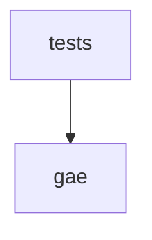

# Code Graph Review — graph-attention-engine-v50

**Generated by:** code_graph_review.py
**Root:** C:\Users\baner\CopyFolder\IoT_thoughts\python-projects\kaggle_experiments\claude_projects\graph-attention-engine-v50

## Summary

| Metric | Value |
|--------|-------|
| Total modules | 82 |
| Source modules | 31 |
| Test modules | 51 |
| Total lines | 25,098 |
| Source lines | 10,590 |
| Test lines | 14,508 |
| Classes | 284 |
| Top-level functions | 453 |
| External dependencies | 22 |
| Circular dependencies | 0 |
| Dead export candidates | 138 |

## Module Inventory

| Module | Lines | Classes | Functions | Internal Imports | External |
|--------|-------|---------|-----------|-----------------|----------|
| examples\minimal_domain\run_example.py | 200 | 0 | 0 | 0 | 3 |
| gae\__init__.py | 310 | 0 | 0 | 24 | 1 |
| gae\ablation.py | 203 | 2 | 2 | 1 | 3 |
| gae\batch_pipeline.py | 294 | 8 | 0 | 0 | 5 |
| gae\bootstrap.py | 311 | 1 | 4 | 2 | 6 |
| gae\calibration.py | 861 | 2 | 15 | 0 | 5 |
| gae\contracts.py | 217 | 3 | 0 | 0 | 3 |
| gae\convergence.py | 1178 | 4 | 15 | 1 | 4 |
| gae\covariance.py | 277 | 2 | 0 | 0 | 4 |
| gae\dk_estimator.py | 272 | 2 | 0 | 0 | 3 |
| gae\enrichment_advisor.py | 80 | 0 | 1 | 0 | 1 |
| gae\evaluation.py | 304 | 2 | 2 | 0 | 4 |
| gae\events.py | 121 | 3 | 0 | 0 | 4 |
| gae\factors.py | 126 | 1 | 1 | 1 | 3 |
| gae\judgment.py | 227 | 1 | 3 | 0 | 4 |
| gae\kernel_selector.py | 492 | 3 | 0 | 1 | 4 |
| gae\kernels.py | 278 | 3 | 0 | 0 | 3 |
| gae\learning.py | 677 | 4 | 0 | 2 | 5 |
| gae\novelty.py | 143 | 2 | 0 | 0 | 2 |
| gae\oracle.py | 245 | 4 | 0 | 0 | 4 |
| gae\primitives.py | 161 | 0 | 3 | 0 | 2 |
| gae\profile_scorer.py | 1280 | 5 | 1 | 6 | 6 |
| gae\referral.py | 345 | 6 | 0 | 0 | 4 |
| gae\scoring.py | 210 | 1 | 2 | 3 | 5 |
| gae\shrinkage.py | 81 | 3 | 1 | 1 | 3 |
| gae\snr.py | 313 | 2 | 6 | 2 | 5 |
| gae\store.py | 200 | 1 | 2 | 0 | 9 |
| gae\synthetic.py | 380 | 7 | 0 | 2 | 4 |
| gae\two_phase.py | 94 | 5 | 0 | 0 | 3 |
| prompt0_gae_structural_map.py | 229 | 0 | 0 | 0 | 2 |
| tests\__init__.py (test) | 0 | 0 | 0 | 0 | 0 |
| tests\test_ablation.py (test) | 114 | 8 | 1 | 3 | 2 |
| tests\test_adversarial_inputs.py (test) | 394 | 9 | 3 | 2 | 5 |
| tests\test_api_contract.py (test) | 478 | 0 | 33 | 3 | 5 |
| tests\test_batch_pipeline.py (test) | 397 | 0 | 30 | 3 | 4 |
| tests\test_bootstrap.py (test) | 143 | 9 | 1 | 2 | 3 |
| tests\test_calibration.py (test) | 947 | 18 | 14 | 4 | 4 |
| tests\test_conservation_monitor.py (test) | 307 | 4 | 0 | 2 | 3 |
| tests\test_consumer_contracts.py (test) | 357 | 9 | 0 | 8 | 4 |
| tests\test_consumer_roundtrip.py (test) | 83 | 0 | 5 | 1 | 2 |
| tests\test_contracts.py (test) | 114 | 3 | 0 | 1 | 1 |
| tests\test_convergence.py (test) | 780 | 16 | 5 | 4 | 2 |
| tests\test_covariance.py (test) | 221 | 5 | 0 | 1 | 2 |
| tests\test_determinism.py (test) | 230 | 5 | 1 | 2 | 5 |
| tests\test_diagonal_kernel.py (test) | 144 | 1 | 0 | 0 | 3 |
| tests\test_dk_estimator.py (test) | 280 | 3 | 2 | 1 | 3 |
| tests\test_entropy_edge_cases.py (test) | 25 | 0 | 3 | 1 | 1 |
| tests\test_evaluation.py (test) | 142 | 8 | 1 | 3 | 2 |
| tests\test_events.py (test) | 87 | 3 | 0 | 1 | 2 |
| tests\test_factors.py (test) | 90 | 4 | 1 | 2 | 2 |
| tests\test_fw04_integration.py (test) | 234 | 1 | 18 | 4 | 4 |
| tests\test_fw05_phase_a_gate.py (test) | 534 | 1 | 41 | 5 | 3 |
| tests\test_fw08_checkpoint.py (test) | 207 | 1 | 14 | 3 | 3 |
| tests\test_fw09_phase_b_gate.py (test) | 310 | 1 | 17 | 5 | 2 |
| tests\test_generic_domains.py (test) | 700 | 13 | 5 | 6 | 7 |
| tests\test_harness_validation.py (test) | 514 | 8 | 0 | 5 | 2 |
| tests\test_judgment.py (test) | 138 | 8 | 1 | 2 | 2 |
| tests\test_kernel_properties.py (test) | 319 | 4 | 0 | 2 | 3 |
| tests\test_kernel_selector.py (test) | 612 | 9 | 10 | 1 | 2 |
| tests\test_kernels.py (test) | 530 | 10 | 0 | 3 | 2 |
| tests\test_learning.py (test) | 353 | 3 | 6 | 3 | 2 |
| tests\test_mathematical_properties.py (test) | 392 | 5 | 2 | 3 | 4 |
| tests\test_novelty.py (test) | 184 | 0 | 18 | 1 | 2 |
| tests\test_numerical_stability.py (test) | 298 | 6 | 1 | 3 | 5 |
| tests\test_oracle.py (test) | 199 | 0 | 9 | 2 | 2 |
| tests\test_primitives.py (test) | 115 | 2 | 0 | 1 | 2 |
| tests\test_profile_scorer.py (test) | 1176 | 1 | 71 | 3 | 4 |
| tests\test_recommend_edge_cases.py (test) | 41 | 0 | 6 | 1 | 2 |
| tests\test_referral.py (test) | 291 | 6 | 0 | 1 | 1 |
| tests\test_score_edge_cases.py (test) | 76 | 0 | 11 | 1 | 3 |
| tests\test_scoring.py (test) | 127 | 3 | 1 | 1 | 2 |
| tests\test_serialization.py (test) | 288 | 5 | 1 | 2 | 6 |
| tests\test_setter_edge_cases.py (test) | 39 | 0 | 5 | 1 | 3 |
| tests\test_shape_contracts.py (test) | 241 | 6 | 1 | 3 | 3 |
| tests\test_shrinkage.py (test) | 132 | 0 | 15 | 2 | 2 |
| tests\test_snr.py (test) | 181 | 0 | 6 | 2 | 1 |
| tests\test_soc_integration.py (test) | 556 | 7 | 1 | 4 | 4 |
| tests\test_store.py (test) | 100 | 2 | 0 | 1 | 6 |
| tests\test_synthetic.py (test) | 107 | 0 | 7 | 2 | 2 |
| tests\test_two_phase.py (test) | 56 | 0 | 6 | 1 | 0 |
| tests\test_update_edge_cases.py (test) | 125 | 0 | 10 | 1 | 3 |
| tools\iks_bakeoff.py | 481 | 0 | 12 | 0 | 4 |

## Class & Function Index

### gae\ablation.py
- **class** `AblationResult` (line 24)
- **class** `AblationReport` (line 57)
- **def** `_zero_factor` (line 87)
- **def** `run_ablation` (line 126)

### gae\batch_pipeline.py
- **class** `BatchCompositionPolicy` (line 12)
- **class** `NoveltyThresholdPolicy` (line 29)
- **class** `FixedIntervalPolicy` (line 72)
- **class** `GateVerdict` (line 106)
- **class** `PromotionGate` (line 121)
- **class** `DefaultPromotionGate` (line 135)
- **class** `BatchRecord` (line 217)
- **class** `BatchHistory` (line 232)

### gae\bootstrap.py
- **class** `BootstrapResult` (line 64)
- **def** `_assert_bootstrap_anchor_not_overwritten` (line 26)
- **def** `write_iks_bootstrap_anchor` (line 44)
- **def** `bootstrap_calibration` (line 94)
- **def** `bootstrap_enriched_prior` (line 253)

### gae\calibration.py
- **class** `CalibrationProfile` (line 21)
- **class** `ConservationCheck` (line 143)
- **def** `soc_calibration_profile` (line 96)
- **def** `s2p_calibration_profile` (line 121)
- **def** `derive_theta_min` (line 153)
- **def** `compute_theta_min` (line 194)
- **def** `check_conservation` (line 225)
- **def** `compute_breach_window` (line 276)
- **def** `compute_optimal_tau` (line 321)
- **def** `compute_transfer_prior` (line 358)
- **def** `compute_eta_override` (line 394)
- **def** `check_meta_conservation` (line 464)
- **def** `compute_factor_mask` (line 529)
- **def** `compute_enriched_bootstrap_prior` (line 568)
- **def** `compute_dominant_axis` (line 688)
- **def** `compute_enriched_bootstrap_prior_geom` (line 729)
- **def** `mask_to_array` (line 834)

### gae\contracts.py
- **class** `PropertySpec` (line 23)
- **class** `EmbeddingContract` (line 93)
- **class** `SchemaContract` (line 123)

### gae\convergence.py
- **class** `ConservationMonitor` (line 636)
- **class** `OLSMonitor` (line 809)
- **class** `VarQMonitor` (line 967)
- **class** `ConvergenceTrace` (line 1151)
- **def** `compute_n_half` (line 48)
- **def** `compute_per_factor_n_half` (line 66)
- **def** `compute_steady_state_mse` (line 101)
- **def** `compute_e_inf_per_component` (line 129)
- **def** `predict_convergence_decisions` (line 162)
- **def** `predict_convergence_decisions_v2` (line 204)
- **def** `enrichment_multiplier` (line 259)
- **def** `reconvergence_acceleration` (line 292)
- **def** `predict_category_convergence_weeks` (line 317)
- **def** `generate_onboarding_calendar` (line 395)
- **def** `get_convergence_metrics` (line 486)
- **def** `compute_normalized_var_q` (line 562)
- **def** `centroid_distance_to_canonical` (line 1075)
- **def** `gamma_threshold` (line 1098)
- **def** `phase2_effective_threshold` (line 1123)

### gae\covariance.py
- **class** `CovarianceSnapshot` (line 22)
- **class** `CovarianceEstimator` (line 54)

### gae\dk_estimator.py
- **class** `DKEstimator` (line 20)
- **class** `CoordinateDescentEstimator` (line 34)

### gae\enrichment_advisor.py
- **def** `rank_enrichment_opportunities` (line 18)

### gae\evaluation.py
- **class** `EvaluationScenario` (line 22)
- **class** `EvaluationReport` (line 68)
- **def** `compute_ece` (line 105)
- **def** `run_evaluation` (line 161)

### gae\events.py
- **class** `FactorComputedEvent` (line 19)
- **class** `WeightsUpdatedEvent` (line 53)
- **class** `ConvergenceEvent` (line 94)

### gae\factors.py
- **class** `FactorComputer` (line 36)
- **def** `assemble_factor_vector` (line 74)

### gae\judgment.py
- **class** `JudgmentResult` (line 28)
- **def** `_confidence_tier` (line 65)
- **def** `_dominant_factors` (line 84)
- **def** `compute_judgment` (line 137)

### gae\kernel_selector.py
- **class** `KernelScore` (line 31)
- **class** `KernelRecommendation` (line 69)
- **class** `KernelSelector` (line 80)

### gae\kernels.py
- **class** `ScoringKernel` (line 24)
- **class** `L2Kernel` (line 64)
- **class** `DiagonalKernel` (line 108)

### gae\learning.py
- **class** `DimensionMetadata` (line 75)
- **class** `PendingValidation` (line 118)
- **class** `WeightUpdate` (line 157)
- **class** `LearningState` (line 210)

### gae\novelty.py
- **class** `NoveltyTracker` (line 30)
- **class** `NearestNeighborNovelty` (line 47)

### gae\oracle.py
- **class** `OracleResult` (line 25)
- **class** `OracleProvider` (line 52)
- **class** `GTAlignedOracle` (line 84)
- **class** `BernoulliOracle` (line 171)

### gae\primitives.py
- **def** `compute_entropy` (line 27)
- **def** `softmax` (line 45)
- **def** `scaled_dot_product_attention` (line 79)

### gae\profile_scorer.py
- **class** `CentroidUpdate` (line 45)
- **class** `LearningStrategy` (line 66)
- **class** `KernelType` (line 74)
- **class** `ScoringResult` (line 97)
- **class** `ProfileScorer` (line 130)
- **def** `build_profile_scorer` (line 1252)

### gae\referral.py
- **class** `ReferralReason` (line 34)
- **class** `ReferralDecision` (line 64)
- **class** `ReferralRule` (line 126)
- **class** `ReferralEngine` (line 186)
- **class** `OverrideDetectorConfig` (line 243)
- **class** `OverrideDetector` (line 259)

### gae\scoring.py
- **class** `ScoringResult` (line 41)
- **def** `score_entity` (line 76)
- **def** `score_with_profile` (line 192)

### gae\shrinkage.py
- **class** `ShrinkageSchedule` (line 22)
- **class** `FixedAlpha` (line 30)
- **class** `LinearRampAlpha` (line 43)
- **def** `compute_effective_weights` (line 77)

### gae\snr.py
- **class** `CategorySNR` (line 53)
- **class** `SNRReport` (line 91)
- **def** `_phi` (line 42)
- **def** `_default_names` (line 122)
- **def** `_validate_vector` (line 126)
- **def** `_pairwise_distances` (line 136)
- **def** `_status_for_ceiling` (line 157)
- **def** `compute_snr_report` (line 165)

### gae\store.py
- **class** `LearningState` (line 31)
- **def** `save_state` (line 125)
- **def** `load_state` (line 170)

### gae\synthetic.py
- **class** `FactorVectorSample` (line 31)
- **class** `FactorVectorSampler` (line 39)
- **class** `CanonicalCentroid` (line 102)
- **class** `Phase1Result` (line 143)
- **class** `Phase2Result` (line 152)
- **class** `GammaResult` (line 160)
- **class** `OracleSeparationExperiment` (line 182)

### gae\two_phase.py
- **class** `CategoryState` (line 25)
- **class** `PhasePolicy` (line 54)
- **class** `DecisionCountPolicy` (line 62)
- **class** `ManualPolicy` (line 73)
- **class** `RollingAccuracyDeltaPolicy` (line 81)

### tools\iks_bakeoff.py
- **def** `simulate_iks` (line 25)
- **def** `trajectories_option_a` (line 89)
- **def** `trajectories_option_b` (line 112)
- **def** `trajectories_option_c` (line 133)
- **def** `trajectories_option_d` (line 155)
- **def** `evaluate_c1` (line 173)
- **def** `evaluate_c2` (line 199)
- **def** `evaluate_c3` (line 212)
- **def** `evaluate_c4` (line 225)
- **def** `evaluate_c5` (line 238)
- **def** `run_bakeoff` (line 311)
- **def** `print_results` (line 385)

## Dependency Graph

## Coupling Metrics

| Directory | Efferent (Ce) | Afferent (Ca) | Instability |
|-----------|--------------|--------------|-------------|
| examples | 0 | 0 | 0.0 |
| gae | 46 | 119 | 0.279 |
| root | 0 | 0 | 0.0 |
| tests | 119 | 0 | 1.0 |
| tools | 0 | 0 | 0.0 |

## Circular Dependencies

None detected.

## Dead Export Candidates

(Public names defined but never imported internally)

- `AblationReport` at gae\ablation.py:57
- `AblationResult` at gae\ablation.py:24
- `run_ablation` at gae\ablation.py:126
- `BatchCompositionPolicy` at gae\batch_pipeline.py:12
- `BatchHistory` at gae\batch_pipeline.py:232
- `BatchRecord` at gae\batch_pipeline.py:217
- `DefaultPromotionGate` at gae\batch_pipeline.py:135
- `FixedIntervalPolicy` at gae\batch_pipeline.py:72
- `GateVerdict` at gae\batch_pipeline.py:106
- `NoveltyThresholdPolicy` at gae\batch_pipeline.py:29
- `PromotionGate` at gae\batch_pipeline.py:121
- `BootstrapResult` at gae\bootstrap.py:64
- `bootstrap_calibration` at gae\bootstrap.py:94
- `bootstrap_enriched_prior` at gae\bootstrap.py:253
- `write_iks_bootstrap_anchor` at gae\bootstrap.py:44
- `CalibrationProfile` at gae\calibration.py:21
- `ConservationCheck` at gae\calibration.py:143
- `check_conservation` at gae\calibration.py:225
- `check_meta_conservation` at gae\calibration.py:464
- `compute_breach_window` at gae\calibration.py:276
- `compute_dominant_axis` at gae\calibration.py:688
- `compute_enriched_bootstrap_prior` at gae\calibration.py:568
- `compute_enriched_bootstrap_prior_geom` at gae\calibration.py:729
- `compute_eta_override` at gae\calibration.py:394
- `compute_factor_mask` at gae\calibration.py:529
- `compute_optimal_tau` at gae\calibration.py:321
- `compute_theta_min` at gae\calibration.py:194
- `compute_transfer_prior` at gae\calibration.py:358
- `derive_theta_min` at gae\calibration.py:153
- `mask_to_array` at gae\calibration.py:834
- `s2p_calibration_profile` at gae\calibration.py:121
- `soc_calibration_profile` at gae\calibration.py:96
- `EmbeddingContract` at gae\contracts.py:93
- `PropertySpec` at gae\contracts.py:23
- `SchemaContract` at gae\contracts.py:123
- `ConservationMonitor` at gae\convergence.py:636
- `ConvergenceTrace` at gae\convergence.py:1151
- `OLSMonitor` at gae\convergence.py:809
- `VarQMonitor` at gae\convergence.py:967
- `centroid_distance_to_canonical` at gae\convergence.py:1075
- `compute_e_inf_per_component` at gae\convergence.py:129
- `compute_n_half` at gae\convergence.py:48
- `compute_normalized_var_q` at gae\convergence.py:562
- `compute_per_factor_n_half` at gae\convergence.py:66
- `compute_steady_state_mse` at gae\convergence.py:101
- `enrichment_multiplier` at gae\convergence.py:259
- `gamma_threshold` at gae\convergence.py:1098
- `generate_onboarding_calendar` at gae\convergence.py:395
- `get_convergence_metrics` at gae\convergence.py:486
- `phase2_effective_threshold` at gae\convergence.py:1123
- `predict_category_convergence_weeks` at gae\convergence.py:317
- `predict_convergence_decisions` at gae\convergence.py:162
- `predict_convergence_decisions_v2` at gae\convergence.py:204
- `reconvergence_acceleration` at gae\convergence.py:292
- `CovarianceEstimator` at gae\covariance.py:54
- `CovarianceSnapshot` at gae\covariance.py:22
- `CoordinateDescentEstimator` at gae\dk_estimator.py:34
- `DKEstimator` at gae\dk_estimator.py:20
- `rank_enrichment_opportunities` at gae\enrichment_advisor.py:18
- `EvaluationReport` at gae\evaluation.py:68
- `EvaluationScenario` at gae\evaluation.py:22
- `compute_ece` at gae\evaluation.py:105
- `run_evaluation` at gae\evaluation.py:161
- `ConvergenceEvent` at gae\events.py:94
- `FactorComputedEvent` at gae\events.py:19
- `WeightsUpdatedEvent` at gae\events.py:53
- `FactorComputer` at gae\factors.py:36
- `assemble_factor_vector` at gae\factors.py:74
- `JudgmentResult` at gae\judgment.py:28
- `compute_judgment` at gae\judgment.py:137
- `KernelRecommendation` at gae\kernel_selector.py:69
- `KernelScore` at gae\kernel_selector.py:31
- `KernelSelector` at gae\kernel_selector.py:80
- `DiagonalKernel` at gae\kernels.py:108
- `L2Kernel` at gae\kernels.py:64
- `ScoringKernel` at gae\kernels.py:24
- `DimensionMetadata` at gae\learning.py:75
- `LearningState` at gae\learning.py:210
- `PendingValidation` at gae\learning.py:118
- `WeightUpdate` at gae\learning.py:157
- `NearestNeighborNovelty` at gae\novelty.py:47
- `NoveltyTracker` at gae\novelty.py:30
- `BernoulliOracle` at gae\oracle.py:171
- `GTAlignedOracle` at gae\oracle.py:84
- `OracleProvider` at gae\oracle.py:52
- `OracleResult` at gae\oracle.py:25
- `compute_entropy` at gae\primitives.py:27
- `scaled_dot_product_attention` at gae\primitives.py:79
- `softmax` at gae\primitives.py:45
- `CentroidUpdate` at gae\profile_scorer.py:45
- `KernelType` at gae\profile_scorer.py:74
- `LearningStrategy` at gae\profile_scorer.py:66
- `ProfileScorer` at gae\profile_scorer.py:130
- `ScoringResult` at gae\profile_scorer.py:97
- `build_profile_scorer` at gae\profile_scorer.py:1252
- `OverrideDetector` at gae\referral.py:259
- `OverrideDetectorConfig` at gae\referral.py:243
- `ReferralDecision` at gae\referral.py:64
- `ReferralEngine` at gae\referral.py:186
- `ReferralReason` at gae\referral.py:34
- `ReferralRule` at gae\referral.py:126
- `ScoringResult` at gae\scoring.py:41
- `score_entity` at gae\scoring.py:76
- `score_with_profile` at gae\scoring.py:192
- `FixedAlpha` at gae\shrinkage.py:30
- `LinearRampAlpha` at gae\shrinkage.py:43
- `ShrinkageSchedule` at gae\shrinkage.py:22
- `compute_effective_weights` at gae\shrinkage.py:77
- `CategorySNR` at gae\snr.py:53
- `SNRReport` at gae\snr.py:91
- `compute_snr_report` at gae\snr.py:165
- `LearningState` at gae\store.py:31
- `load_state` at gae\store.py:170
- `save_state` at gae\store.py:125
- `CanonicalCentroid` at gae\synthetic.py:102
- `FactorVectorSample` at gae\synthetic.py:31
- `FactorVectorSampler` at gae\synthetic.py:39
- `GammaResult` at gae\synthetic.py:160
- `OracleSeparationExperiment` at gae\synthetic.py:182
- `Phase1Result` at gae\synthetic.py:143
- `Phase2Result` at gae\synthetic.py:152
- `CategoryState` at gae\two_phase.py:25
- `DecisionCountPolicy` at gae\two_phase.py:62
- `ManualPolicy` at gae\two_phase.py:73
- `PhasePolicy` at gae\two_phase.py:54
- `RollingAccuracyDeltaPolicy` at gae\two_phase.py:81
- `evaluate_c1` at tools\iks_bakeoff.py:173
- `evaluate_c2` at tools\iks_bakeoff.py:199
- `evaluate_c3` at tools\iks_bakeoff.py:212
- `evaluate_c4` at tools\iks_bakeoff.py:225
- `evaluate_c5` at tools\iks_bakeoff.py:238
- `print_results` at tools\iks_bakeoff.py:385
- `run_bakeoff` at tools\iks_bakeoff.py:311
- `simulate_iks` at tools\iks_bakeoff.py:25
- `trajectories_option_a` at tools\iks_bakeoff.py:89
- `trajectories_option_b` at tools\iks_bakeoff.py:112
- `trajectories_option_c` at tools\iks_bakeoff.py:133
- `trajectories_option_d` at tools\iks_bakeoff.py:155

## External Dependencies

- __future__
- copy
- dataclasses
- datetime
- enum
- gae
- hashlib
- json
- logging
- math
- numpy
- os
- pathlib
- pickle
- pytest
- sqlite3
- sys
- tempfile
- time
- types
- typing
- warnings
